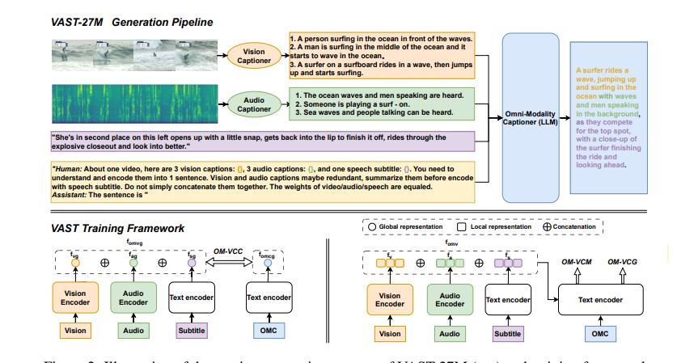
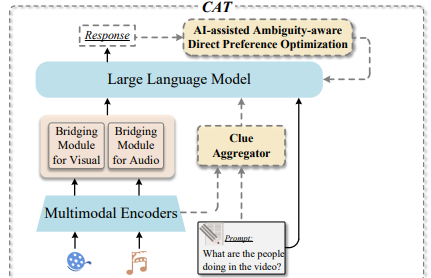

# Awesome-T2I/T2V-safety-Papers

A **continual** collection of papers related to Multi-Modality LLM, especially for audio.

# 🚀 The scope of our collection

💡 **Topic 1:** Multi Modality inputs --> text
   >  
💡 **Topic 1:** Other Task, TTA, ASR

💡 **Topic 1:** Application

  
---
# Models
## 💡 Multi Modality inputs --> text

#### [0] MM-LLMs: Recent Advances in MultiModal Large Language Models
- **🧑‍🔬 Author**:  Duzhen Zhang, Yahan Yu, Jiahua Dong, Chenxing Li, Dan Su, Chenhui Chu, Dong Yu
- **🏫 Affiliation**: Tencent AI Lab, China 2Tencent AI Lab, USA 3Kyoto University, Japan; Mohamed bin Zayed University of Artificial Intelligence, United Arab Emirates
- **🔗 Link**: [[Code]()] [[paper](https://arxiv.org/abs/2401.13601)]
- **📝 Note**: 
Summary of MMLLM.

#### [1] Meerkat: Audio-Visual Large Language Model for Grounding in Space and Time
- **🧑‍🔬 Author**:  Sanjoy Chowdhury, Sayan Nag, Subhrajyoti Dasgupta, Jun Chen, Mohamed Elhoseiny, Ruohan Gao, Dinesh Manocha
- **🏫 Affiliation**: University of Maryland, College Park, University of Toronto, Mila and Université de Montréal, King Abdullah University of Science and Technology
- **🔗 Link**: [[Code]()] [[paper](https://arxiv.org/abs/2407.01851)]
- **📝 Note**:
A traditional model

#### [2] UnifiedMLLM: Enabling Unified Representation for Multi-modal Multi-tasks With Large Language Model
- **🧑‍🔬 Author**:  Zhaowei Li, Wei Wang, YiQing Cai, Xu Qi, Pengyu Wang, Dong Zhang, Hang Song, Botian Jiang, Zhida Huang, Tao Wang
- **🏫 Affiliation**: ByteDance Inc, 2Fudan University, University of Science and Technology of China

- **🔗 Link**: [[Code](https://github.com/lzw-lzw/UnifiedMLLM)] [[paper](https://arxiv.org/abs/2408.02503)]
- **📝 Note**: Multi task, multi types of inputs and output

#### [3] X-VILA: Cross-Modality Alignment for Large Language Model
- **🧑‍🔬 Author**:  Hanrong Ye, De-An Huang, Yao Lu, Zhiding Yu, Wei Ping, Andrew Tao, Jan Kautz, Song Han, Dan Xu, Pavlo Molchanov, Hongxu Yin
- **🏫 Affiliation**: NVIDIA, HKUST, MIT

- **🔗 Link**: [[Code]()] [[paper](https://arxiv.org/abs/2405.19335)]
- **📝 Note**:

#### [4] VAST: A Vision-Audio-Subtitle-Text Omni-Modality Foundation Model and Dataset
- **🧑‍🔬 Author**: Sihan Chen, Handong Li, Qunbo Wang, Zijia Zhao, Mingzhen Sun, Xinxin Zhu, Jing Liu
- **🏫 Affiliation**: School of Artificial Intelligence, University of Chinese Academy of Sciences; Institute of Automation, Chinese Academy of Science
- **🔗 Link**: [[Code](https://github.com/TXH-mercury/VAST)] [[paper](https://proceedings.neurips.cc/paper_files/paper/2023/file/e6b2b48b5ed90d07c305932729927781-Paper-Conference.pdf)]
- **📝 Note**:
 Use video and audio captioner to allign the heterogeneity of different format input

#### [5] CAT: Enhancing Multimodal Large Language Model to Answer Questions in Dynamic Audio-Visual Scenarios
- **🧑‍🔬 Author**: Qilang Ye, Zitong Yu, Rui Shao, Xinyu Xie, Philip Torr, Xiaochun Cao
- **🏫 Affiliation**: Great Bay University, Harbin Institute of Technology, ShenZhen, University of Oxford, Shenzhen Campus of Sun Yat-sen University
- **🔗 Link**: [[Code](https://github.com/rikeilong/Bay-CAT)] [[arXiv:2403.04640v1](https://arxiv.org/pdf/2403.04640)]
- **📝 Note**: 🔥 
- **Problem**: the responses are sometimes ambiguous and fail to describe specific audio-visual events
- **Method**: 
  video and audio go through a multi-encoder, and then bridging, encoded representation combine prompt to generate clue

  1. aggregates question-related clues in dynamic, audio-visual scenarios to enrich the detailed knowledge required for large language models
  2. trained on a mixed multimodal dataset, allowing direct application in audio-visual scenarios
  3. retraining the model to favor the non-ambiguity response and improve the ability to localize specific audio visual objects.

#### [] 
- **🧑‍🔬 Author**:  
- **🏫 Affiliation**: 
- **🔗 Link**: [[Code]()] [[paper]()]
- **📝 Note**:

## 💡 Other Task, TTA, ASR

#### [0] UniAudio 1.5: Large Language Model-driven Audio Codec is A Few-shot Audio Task Learner
- **🧑‍🔬 Author**: Dongchao Yang, Haohan Guo, Yuanyuan Wang, Rongjie Huang, Xiang Li, Xu Tan, Xixin Wu, Helen Meng
- **🏫 Affiliation**: The Chinese University of Hong Kong, Tsinghua University, Microsoft Research Asia
- **🔗 Link**: [[Code](https://github.com/yangdongchao/LLM-Codec)] [[arXiv:2406.10056v1](https://arxiv.org/pdf/2406.10056)]
- **📝 Note**: propose a cross modal in-context learning short style without any parameter update. Audio Codec Models, Multimodal LLM, in-context Learning.

The model is simple, but the Codec is novel

#### [1] Improving Audio Codec-based Zero-Shot Text-to-Speech Synthesis with Multi-Modal Context and Large Language Model
- **🧑‍🔬 Author**:  Jinlong Xue, Yayue Deng, Yicheng Han, Yingming Gao, Ya Li
- **🏫 Affiliation**: Beijing University of Posts and Telecommunications, Beijing, China
- **🔗 Link**: [[Code]()] [[arXiv:2406.03706v1](https://arxiv.org/pdf/2406.03706)]
- **📝 Note**:
Trying to generate speech output with the input of text, prompt speech and Context text& audio

#### [2] Multi-Modal Retrieval For Large Language Model Based Speech Recognition
- **🧑‍🔬 Author**:  Aditya Gourav, Jari Kolehmainen, Prashanth Shivakumar, Yile Gu, Grant Strimel, Ankur Gandhe, Ariya Rastrow, Ivan Bulyko
- **🏫 Affiliation**: 
- **🔗 Link**: [[Code]()] [[paper](https://aclanthology.org/2024.findings-acl.262/)]
- **📝 Note**:

#### [] 
- **🧑‍🔬 Author**:  
- **🏫 Affiliation**: 
- **🔗 Link**: [[Code]()] [[paper]()]
- **📝 Note**:

#### [] 
- **🧑‍🔬 Author**:  
- **🏫 Affiliation**: 
- **🔗 Link**: [[Code]()] [[paper]()]
- **📝 Note**:

## 💡 Topic 3 Application

#### [0] ChatGPT for shaping the future of dentistry: the potential of multi-modal large language model
- **🧑‍🔬 Author**:  Hanyao Huang, Ou Zheng, Dongdong Wang, Jiayi Yin, Zijin Wang, Shengxuan Ding, Heng Yin, Chuan Xu, Renjie Yang, Qian Zheng & Bing Shi 
- **🏫 Affiliation**: 
- **🔗 Link**: [[Code]()] [[paper](https://www.nature.com/articles/s41368-023-00239-y)]
- **📝 Note**:

#### [] 
- **🧑‍🔬 Author**:  
- **🏫 Affiliation**: 
- **🔗 Link**: [[Code]()] [[paper]()]
- **📝 Note**: 

### 👍 Acknowledgement
Thanks to the [3D-Gaussian-Splatting-Papers](https://github.com/Awesome3DGS/3D-Gaussian-Splatting-Papers).